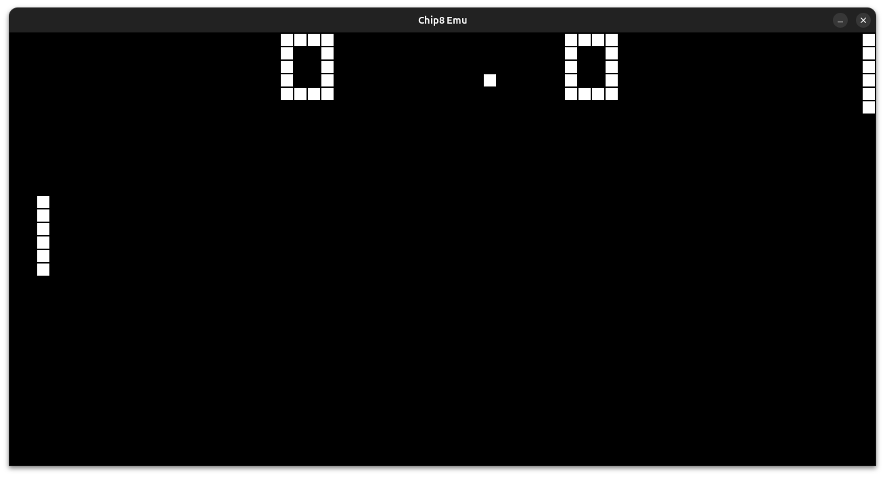

# CHIP8-Interpreter
A [CHIP8](https://en.wikipedia.org/wiki/CHIP-8) Interpreter made with [SDL2](https://www.libsdl.org) for learning purposes.


# Usage
Compiles on Linux.

### To build: 
```console 
make
```
### To run: 
```console 
./chip8 path/to/rom -flags
```
### Optional flags:
* -s %d (scale factor)
* -ipf %d (instructions per frame)
* -po %d (pixel outlines 0 or 1 value)
* -v %d (volume)
